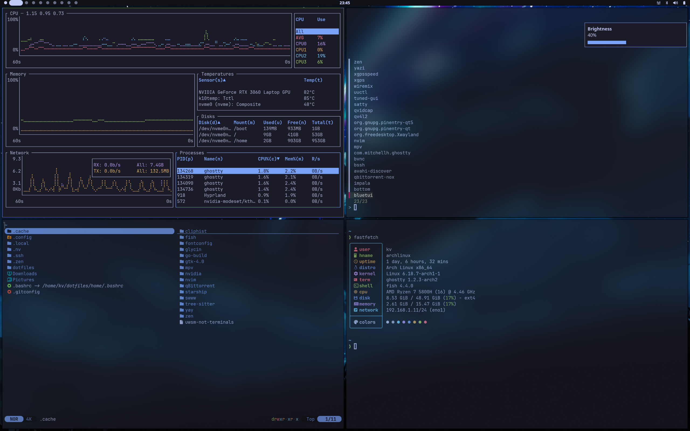

# Clean Hyprland config, with heavy reliance on Ghostty, fzf, ripgrep and matugen

Most of my effort was put in local/bin, which has an arsenal of fzf-based menus (and more) which are run with the 'open-ghostty', to supplement Rofi, as fzf has a better matcher, and that is one less config I have to worry about.

### Vim-compliant navigation
no arrow keys for navigation, ever

### Custom theme support using Matugen as backend
the config relies on matugen for theming, but it also extends its functionality to add custom base16 colorschemes like catppuccin, gruvbox etc. using the command matugen json.

All themes are located in the 'config/matugen/themes' folders and the wallpapers are stored in '~/Pictures/Wallpapers/{optionally theme}' folder, changing a theme is as simple as pressing SUPER, CTRL, Space which opens a yazi window, and you can then select either the theme folder (it has to match the .json filename in the matugen themes folder) to just change the theme and not the wallpaper, or a wallpaper inside the theme folder which changes the wallpaper and also the theme. If you select a wallpaper that is not in any theme folder, then matugen generates dynamic Material You colors for the wallpaper. 

TODO: store the last used wallpaper for each theme, so when you click on the theme folder instead of a png, you use that cached wallpaper instead of not changing it at all

You can also change just the wallpaper without changing the theme using SUPER, CTRl, W
